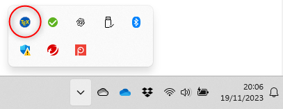
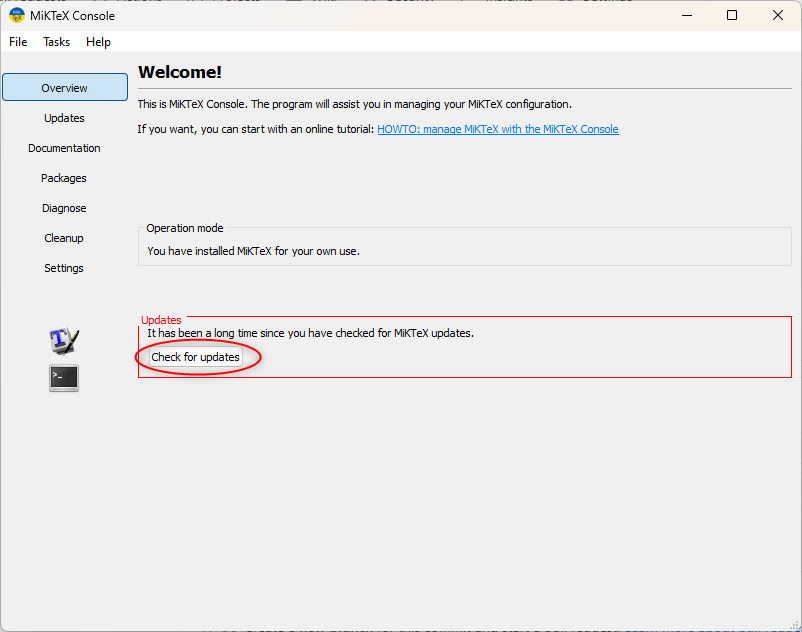
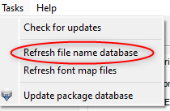
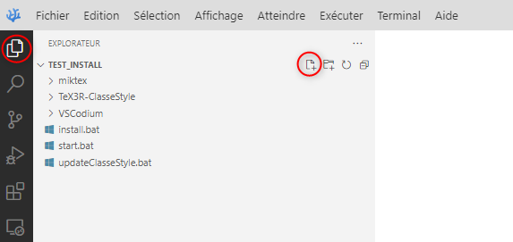
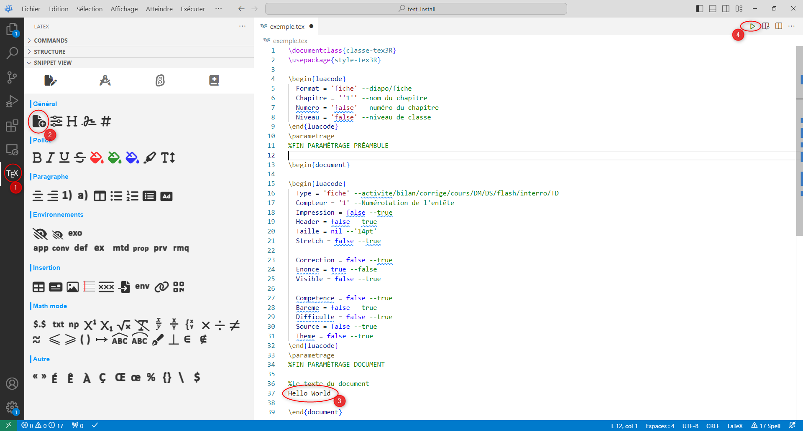

# TeX3R (Environnement LaTeX Portable)

## Description générale

**TeX3R-Portable** c'est une distribution LaTeX portable, préconfigurée avec la classe et le style TeX3R associés.

## Le projet TeX3R

TeX3R c'est avant tout une classe **classe-tex3R.cls** et un style **style-tex3R.sty** pour LaTeX, disponibles à cette adresse : [https://github.com/Tex3rivieres/TeX3R-ClasseStyle/](https://github.com/Tex3rivieres/TeX3R-ClasseStyle)

TeX3R c'est aussi une extension pour VSCode/VSCodium, avec des panels de raccourcis et une configuration adaptée à la classe et au style TeX3R : [https://github.com/Tex3rivieres/TeX3R-Workshop](https://github.com/Tex3rivieres/TeX3R-Workshop)

## TeX3R-Portable installation automatique (Windows)

* Créer un répertoire à la racine du support USB. Par exemple: **".\TeX3R-Portable"**
* Copier InstallTeX3R.bat à l'intérieur et exécuter

A la fin de l'installation 2 fichiers sont créés

* Le fichier "StartTeX3R.bat" permet de démarrer le programme
* Le fichier "updateClasseStyle.bat" permet de mettre à jour la Classe et le Style TeX3R

Le fichier d'installation peut-être supprimé ou utilisé pour refaire une installation complète à jour.

## TeX3R-Portable installation manuelle

### Répertoire du programme

* Créer un répertoire à la racine du support USB. Par exemple: **".\TeX3R-Portable"**

### VSCodium : Éditeur de texte

* Télécharger l'archive de VSCodium adaptée à votre système d'exploitation :  [github.com/VSCodium/vscodium/releases](https://github.com/VSCodium/vscodium/releases)
* Décompresser l'archive dans **".\TeX3R-Portable\VSCodium"**
* Créer le répertoire **".\TeX3R-Portable/VSCodium\data"**

### MiKTeX : Interpréteur Latex

* Télécharger [MiKTeX](https://MiKTeX.org/download)
* Renommer **"basic-MiKTeX-*.exe"** en **"MiKTeX-portable.exe"**
* Exécuter et indiquer **".\TeX3R-Portable\miktex"** comme répertoire d'installation

#### Ajout de la classe et du style TeX3R

Télécharger l'archive de la dernière version de TeX3R-ClasseStyle : [https://github.com/Tex3rivieres/TeX3R-ClasseStyle/releases/latest](https://github.com/Tex3rivieres/TeX3R-ClasseStyle/releases/latest)

Décompresser l'archive et déplacer le sous-répertoire "\tex\lualatex" vers ".\Tex3R-Portable\miktex\texmfs\install\tex"

* Ouvrir la console à partir de la barre des tâches :

> 

* Mettre à jour MiKTeX :

> 

* Rafraîchir la base de données des noms de fichiers

> 

### Premier démarrage

* Créer le fichier **"./TeXR3R-Portable/StartTeX3R.bat"**

Ajouter le contenu

```bash
cd /d %~dp0
:: Variables environnement systeme temporaires
SET PATH=%CD%\miktex\texmfs\install\miktex\bin\x64;%cd%\VSCodium\bin;%PATH%
SET OSFONTDIR=%cd%\TeX3R-ClasseStyle\tex\fonts\TeX3R
start "" "%CD%\Vscodium\VSCodium.exe"
```

Enregistrer et fermer

Exécuter StartTeX3R.bat

Installer l'extension TeX3R

Vous êtes prêt à compiler votre premier fichier TeX

### Première compilation

* Créer un fichier exemple.tex

> 

* Cliquer sur l'icone "Nouveau document" dans le panneau latéral de l'extension Tex3R
* Ecrire un contenu après %Contenu du document

* Lancer la compilation

> 

**Attention**, la première compilation d'un document ```.tex``` est un peu longue car MiKTeX télécharge et installe les packages qui ne sont pas déjà dans sa base.

### Enjoy ;)

### Pour les impatients

Archive prête à l'emploi  à décompresser dans votre support USB : https://flnextcloud.duckdns.org/index.php/s/6Xe5ymey7cBoFK5
