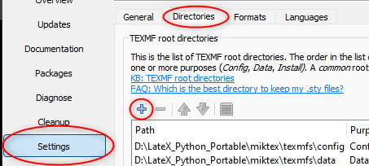

# TeX3R-Portable

## Repertoire du programme
* Créer un répertoire à la racine du support USB. Par exemple: **"./TeX3R-Portable"**
## Git pour installation et mise à jour
 
* Telecharger la version "Git Portable" adaptée à votre sytème d'exploitation :[git-scm.com/downloads](https://git-scm.com/downloads)
   * Décompresser l'archive dans **"./TeX3R-Portable/PortableGit"**

## VSCodium : Editeur de texte

* Télécharger l'archive de VSCodium adaptée à votre sytème d'exploitation :  [github.com/VSCodium/vscodium/releases](https://github.com/VSCodium/vscodium/releases)
   * Décompresser l'archive dans **"./TeX3R-Portable/VSCodium"**
   * Créer le repertoire **"./TeX3R-Portable/VSCodium/data"**

## Miktex : Interpréteur Latex
* Telecharger[Miktex](https://miktex.org/download)
   * Renommer **"basic-miktex-*.exe"** en **"miktex-portable.exe"**
   * Executer et indiquer **"./TeX3R-Portable/miktex"** comme repertoire d'installation
* Copier **TeX3R.bat** dans **"./TeX3R-Portable"**
* Executer **"./TeXR3R-Portable/TeX3R.bat"** puis quitter VSCodium.
* Exécuter **"./Tex3R_Portable/miktex/miktex-portable.cmd"**
   * Ouvrir la console à partir de la barre des tâches :

 
  
   * Mettre à jour Miktex : 

 
  
   * Ajouter **"./TeX3R-Portable/TeX3R-CS"** au "Path" Miktex
 
  

   * Rafraîchir la base de données des noms de fichiers
 
  

## Utilisation du programme
* Utiliser **"./TeXR3R-Portable/TeX3R.bat"** pour éxecuter et maintenir à jour TeX3R
* Installer l'extension TeX3R (1 seule fois)

## Enjoy ;) 

Pour les Impatients : ArchiveSFX prête à l'emploie
